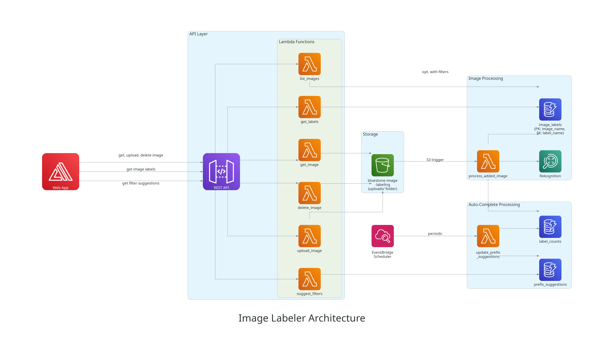

# Image Labeler

An AWS cloud application for automatic image labeling using Amazon Rekognition
with a web interface for viewing, uploading, and filtering images.

## Overview

This project provides an AWS SAM template that creates a complete serverless
application:
- **S3 Bucket** for storing images
- **7 Lambda Functions** for image processing and API operations
- **3 DynamoDB Tables** for storing labels, counts, and autocomplete suggestions
- **API Gateway** with REST endpoints
- **Cognito User Pool** for authentication
- **Amplify Web App** for the user interface
- **EventBridge Scheduler** for periodic updates

## Architecture



### Storage Layer
- **S3 Bucket**: Stores uploaded images
  - Bucket name: `bluestone-image-labeling-a08324be2c5f`
  - Note: Uses hyphens instead of underscores per AWS S3 naming requirements

### API Layer
- **API Gateway**: REST API with Cognito authorization
- **Lambda Functions**:
  - `upload_image`: Handles image uploads to S3
  - `list_images`: Lists images with optional label filtering and pagination
  - `get_image`: Retrieves and resizes images for display
  - `get_labels`: Retrieves labels for specific images
  - `delete_image`: Deletes images from S3 and their labels from DynamoDB
  - `suggest_filters`: Provides autocomplete suggestions for label filtering

### Image Processing
- **Lambda Function**: `process_added_image`
  - Triggered automatically by S3 uploads
  - Uses Amazon Rekognition to detect labels
  - Stores results in `image_labels` and `label_counts` tables
- **Amazon Rekognition**: ML service for automatic image labeling

### Auto-Complete Processing
- **Lambda Function**: `update_prefix_suggestions`
  - Triggered every 30 minutes by EventBridge
  - Processes content of `label_counts` table to generate autocomplete
    suggestions
  - Updates `prefix_suggestions` table

### Database Layer
- **DynamoDB Tables**:
  1. `image_labels`: Stores image labels with composite key
     - Partition Key: `image_name`
     - Sort Key: `label_name`
     - GSI: `label-index` on `label_name` for efficient filtering
  2. `label_counts`: Aggregates label usage counts
  3. `prefix_suggestions`: Stores autocomplete suggestions

### Authentication
- **Cognito User Pool**: Manages user authentication
  - Admin-only user creation
  - Email-based usernames
  - Password policy enforcement

### Web Application
- **AWS Amplify**: Hosts the web interface
  - Auto-deploys from GitHub repository
  - Provides image viewing, uploading, filtering, and deletion

## Deployment

### Prerequisites
- AWS CLI configured with appropriate credentials
- AWS SAM CLI installed (`pip install aws-sam-cli`)
- AWS account with permissions to create CloudFormation stacks, S3 buckets,
  Lambda functions, and IAM roles

### Backend Deployment

The backend is deployed using

```bash
./scripts/deploy_backend.sh
```

In case the stack needs to be setup anew, the `redeploy_backend.sh` should help.
It destroys the existing stack (including the database entries, but not the S3
content) and then builds it up anew.

### Frontend Deployment

The frontend is deployed via AWS Amplify.  
Usually, this happens automatically, when a new commit on the `main` branch is
being pushed to the repository.

Should the need arise, a manual redeployment can be triggered with 

```bash
./scripts/deploy_frontend.sh
```

where a branch name can be specified as an optional parameter (default: `main`).

## Usage

### Web Application

After deployment, access the web application via the Amplify URL (shown in stack outputs):
- View uploaded images
- See generated labels for each image
- Upload new images through the S3 bucket
- Filter images by labels with autocomplete suggestions
- Delete images

### API Endpoints

All endpoints require Cognito authentication via Authorization header.

- **Upload Image**: `POST /upload_image`
  - Body: multipart/form-data with image file
  - Uploads image to S3 bucket

- **List Images**: `GET /images?page={page}&limit={limit}&filters={labels}`
  - Query params: `page` (default: 0), `limit` (default: 10), `filters` (comma-separated labels)
  - Returns paginated list of images with optional label filtering

- **Get Image**: `GET /image/{filename}?maxwidth={width}&maxheight={height}`
  - Query params: `maxwidth`, `maxheight` for resizing
  - Returns resized image as binary data

- **Get Labels**: `GET /labels/{filename}`
  - Returns all labels and confidence scores for an image

- **Delete Image**: `DELETE /image/{filename}`
  - Deletes image from S3 and all associated labels from DynamoDB

- **Suggest Filters**: `GET /suggest_filters?prefix={text}`
  - Query param: `prefix` (text to autocomplete)
  - Returns label suggestions for filtering

### User Management

The application uses Cognito User Pool for authentication with admin-only user creation.
Use the `manage_users.py` script to manage users:

**Invite a new user:**
```bash
python scripts/manage_users.py invite --email user@example.com
```

**Invite with custom temporary password:**
```bash
python scripts/manage_users.py invite --email user@example.com --password TempPass123!
```

**List all users:**
```bash
python scripts/manage_users.py list
```

**Delete a user:**
```bash
python scripts/manage_users.py delete --email user@example.com
```

**First Login:**
Users created with a temporary password must change it on first login through
the web interface.

## Files

- `template.yaml`: AWS SAM template defining all AWS resources
- `lambda/`: Lambda function code
  - `process_added_image.py`: Processes images with Rekognition, stores labels
  - `upload_image.py`: Handles image uploads to S3
  - `list_images.py`: Lists images with filtering and pagination
  - `get_image.py`: Retrieves and resizes images
  - `get_labels.py`: Retrieves labels for specific images
  - `delete_image.py`: Deletes images and their labels
  - `suggest_filters.py`: Provides autocomplete suggestions
  - `update_prefix_suggestions.py`: Generates autocomplete data (scheduled)
  - `tests/`: Unit tests for Lambda functions
    - `test_update_prefix_suggestions.py`: 35 tests, 99% coverage
    - `test_suggest_filters.py`: 11 tests, 100% coverage
    - `test_*.py`: Tests for corresponding Lambda functions
    - `TEST_COVERAGE_REPORT.md`: Detailed coverage report
    - `README.md`: Test documentation
- `scripts/`: Utility scripts
  - `create_architecture_diagram.py`: Generates architecture diagram
  - `manage_users.py`: User management for Cognito
  - `deploy_backend.sh`: Backend deployment script
  - `redeploy_backend.sh`: Full backend redeployment
  - `redeploy_amplify.sh`: Amplify redeployment script
  - `migrate_*.py`: Database migration scripts (legacy)
- `web/`: Web application
  - `index.html`: Frontend interface with authentication
  - `config.js`: Configuration file (updated during build)
- `.codecatalyst/`: CI/CD workflows
